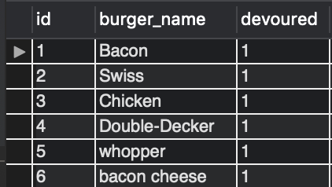
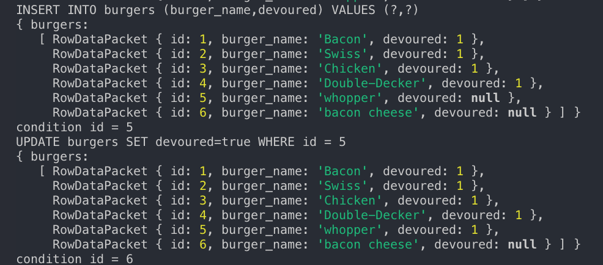

# EatDaBurger
Eat-Da-Burger!

This is a burger logger with MySQL, Node, Express, Handlebars and a homemade ORM (yum!). 
Enter a burger of choice, then devour it! NomNomNom

DataBase being projected onto mySQL

    

    
    

Terminal updating as info is processed on LocalHost

    

    
    

Working from the LocalHost

    

    <video width="320" height="240" controls src="images/EDB.webm"></video>
    
